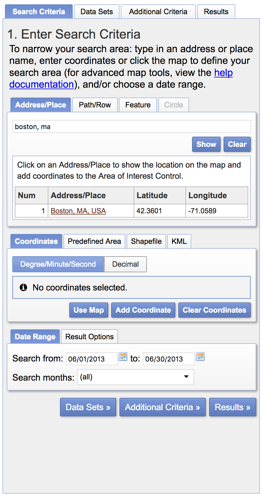

# Problem Set 4: Working With Landsat Data

Your challenge this week is to package the functionality we were working with in the workshop into a series of functions capable of processing Landsat data. You'll then use these functions to process Landsat data you've downloaded, producing estimates of Vegetation Land Surface Temperature. Finally, you'll use the BQA band to write a filter that removes clouds and cloud shadows from our Landsat dataset.

## Download Landsat Data

Download one scene of summertime Landsat 8 data for Boston, MA through [Earth Explorer](https://earthexplorer.usgs.gov/) - you'll have to create an account first! Your search criteria should look something like this:



This data can come from any dates after March 2013---the first period for which Landsat 8 data is available. Prior Landsat data is slightly different, which means that the code we cooked up in the class workshop will not be appropriate.

Once you've decided on a date and a scene, click the 'download options' button () and choose to download the 'Level-1 GeoTIFF Data Product'. This is going to be a big file (~900 MB); do NOT attempt to store it in your Github repository. Extract the downloaded ZIP file into a directory. Take a look and note that the data is stored in files with names much, much longer than the ones we used in class.

## Write a Python Script Using Functions to Process the Data

In class, we wrote one function to calculate the Normalized Difference Vegetation Index and one function to estimate surface emissivity.

Build on these functions, writing six other functions, using the code I showed in in the workshop. Note that when you're working with the Landsat data, you'll need to either...

1. Use the much longer Landsat-provided file names. I recommend doing this, as it will allow you to much more easily use these scripts across multiple Landsat scenes.
2. Rename your files, making them shorter and more... well, appealing I guess.

## Code from Class

```python
from osgeo import gdal
import matplotlib.pyplot as plt
import numpy as np
import os
%matplotlib inline

DATA = "/Users/ehuntley/Desktop/week-05/landsat"

def process_string (st):
    """
    Parses Landsat metadata
    """
    return float(st.split(' = ')[1].strip('\n'))

def ndvi_calc(red, nir):
    """
    Calculate NDVI
    """
    return (nir - red) / (nir + red)

def emissivity_calc (pv, ndvi):
    """
    Calculates an estimate of emissivity
    """
    ndvi_dest = ndvi.copy()
    ndvi_dest[np.where(ndvi < 0)] = 0.991
    ndvi_dest[np.where((0 <= ndvi) & (ndvi < 0.2)) ] = 0.966
    ndvi_dest[np.where((0.2 <= ndvi) & (ndvi < 0.5)) ] = (0.973 * pv[np.where((0.2 <= ndvi) & (ndvi < 0.5)) ]) + (0.966 * (1 - pv[np.where((0.2 <= ndvi) & (ndvi < 0.5)) ]) + 0.005)
    ndvi_dest[np.where(ndvi >= 0.5)] = 0.973
    return ndvi_dest

```
# Your Functions!

```python
def read_tif(location):
    """
    Should:
    1. Use gdal.open to open a connection to a file.
    2. Get band 1 of the raster
    3. Read the band as a numpy array
    4. Convert the numpy array to type 'float32'
    5. Return the numpy array.
    """

def retrieve_meta(meta_text):
    """
    Retrieve variables from the Landsat metadata *_MTL.txt file
    Should return a list of length 4.
    'meta_text' should be the location of your metadata file
    Use the process_string function we created in the workshop.
    """

def rad_calc(tirs, var_list):
    """
    Calculate Top of Atmosphere Spectral Radiance
    Note that you'll have to access the metadata variables by
    their index number in the list.
    """

def bt_calc(rad, var_list):
    """
    Calculate Brightness Temperature
    Again, you'll have to access appropriate metadata variables
    by their index number.
    """

def pv_calc(ndvi, ndvi_s, ndvi_v):
    """
    Calculate Proportional Vegetation
    """

def lst_calc(location):
    """
    Calculate Estimate of Land Surface Temperature.
    ---
    Note that this should take as its input ONLY the location
    of a directory in your file system. That means it will have
    to call your other functions. It should:
    1. Define necessary constants
    2. Read in appropriate tifs (using read_tif)
    3. Retrieve needed variables from metadata (retrieve_meta)
    4. Calculate ndvi, rad, bt, pv, emis using appropriate functions
    5. Calculate LST and return it.
    """

def write(write_nparray, ref_raster, location):
    """
    Write write_nparray as a Geotiff using ref_raster to
    determine size, projection, etc.
    """
```

Use these functions to generate an Normalized Difference Vegetation Index and a Land Surface Temperature Estimate for your downloaded Landsat data.

## Remove Clouds

Your Landsat data contains another band, whose filename ends with `_BQA.tif`. this is the so-called 'quality assessment band', which contains estimates of where there are clouds in our image.

According to the [USGS Landsat documentation](https://landsat.usgs.gov/collectionqualityband), these values are where we can be highly confident that the image is clear and where there are clouds and cloud shadows:

| Attribute               | Pixel Value                                                                                    |
|-------------------------|------------------------------------------------------------------------------------------------|
| Clear                   | 2720, 2724, 2728, 2732                                                                         |
| Cloud Confidence - High | 2800, 2804, 2808, 2812, 6896, 6900, 6904, 6908                                                 |
| Cloud Shadow - High     | 2976, 2980, 2984, 2988, 3008, 3012, 3016, 3020, 7072, 7076, 7080, 7084, 7104, 7108, 7112, 7116 |


Write a function that reclassifies an input Numpy array based on values stored in the BQA. The function should reclassify input data in such a way that pixels, except for those that are clear (for example, 2720), are assigned a value of `nan`. Use the `emissivity_calc` function as a model!

First you'll have to read in the BQA - use your new `read_tif` function!

```python
def cloud_filter(array, bqa):
    """
    Filters out clouds and cloud shadows using values of BQA.
    """
```
